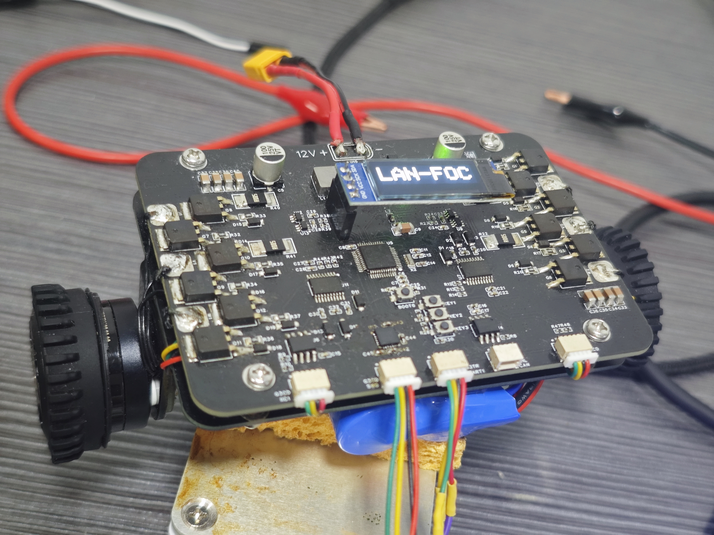
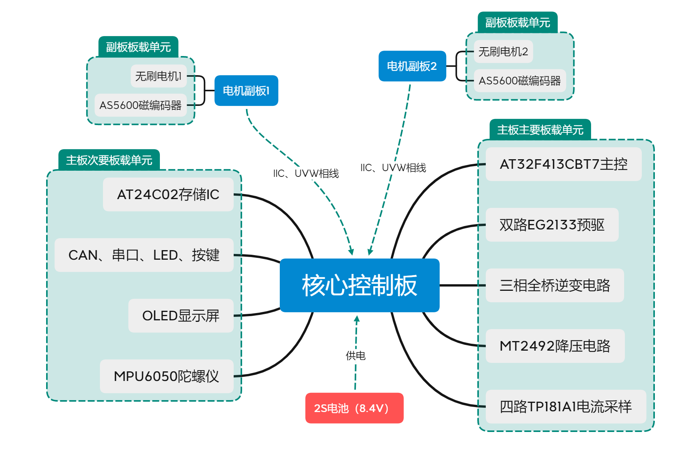
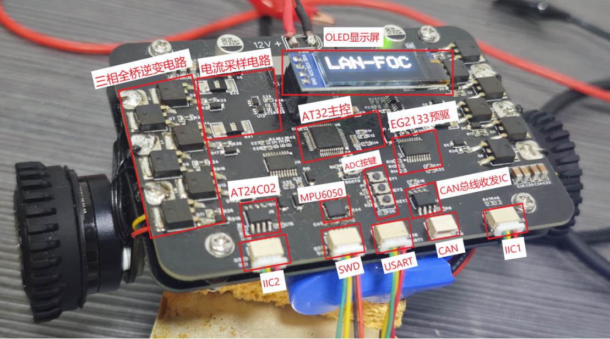

# AT32_FOC

## 介绍

此项目使用AT32主控驱动两路无刷电机，板载陀螺仪mpu6050，外置EEPROM，OLED屏幕，CAN口，两路AS5600磁编码器，旨在使用极低成本实现对无刷电机实现FOC控制，并且大部分元器件采用国产品牌，此板可用于无刷电机驱动，也可做为小平横车，预留串口和SWD调试接口方便后续外接其他设备。

## 一、硬件设置

请跟据hardware文件夹中的PCB文件打样PCB并将元器件贴装好，编码器底板适配带有径向磁铁的无刷电机

板子供电最大支持12V，但是我建议使用2S电池供电，也就是最大8.4V

无刷电机使用2210云台电机（110kV，6PP），但对于这个板子的MOS驱动能力来说完全是吕布骑狗了

预驱使用EG2133非常便宜，MOS使用NCE3080K足以应对绝大部分无刷电机

电流采样电阻为5毫欧的合金采样电阻，使用TP181A1-CR作为电流检测IC增益为50

MCU使用AT32F413CBT7

## 二、软件配置

软件使用platformio开发stm32程序基于Arduino框架，套用st官方维护的SDK，但是由于AT32和STM32的寄存器地址有部分不同，所以官方的SDK被我魔改过，在打开软件工程等待Platformio配置好环境之后，将此压缩包解压到你的platformio的package目录，这样我的修改就会生效，或者你如果不嫌麻烦或者想使用其他版本的SDK，可以根据我这两篇文章来自行配置：

[Arduino如何添加没有适配的GPIO](https://zhuanlan.zhihu.com/p/693456340)

[Arduino如何设置未适配的IO作为功能引脚](https://zhuanlan.zhihu.com/p/693467202)

在一切配置完毕之后你就可以烧录使用了，但注意我在ini配置中制定了烧录器为jlink如果你没有jlink请修改为其他方式

## 三、待完成事项

* [X] 完成AT32时钟适配
* [X] 完成ADC、PWM、UART、IIC、LED、KEY配置
* [X] 完成MPU6050、OLED、EEPROM、CAN配置
* [X] 实现无刷电机开环控制
* [X] 实现无刷电机角度闭环与速度闭环控制
* [X] 为无刷电机添加电流环
* [ ] 添加几个电机互动小功能
* [ ] 设计电池电压检测保护电池
* [ ] 设计多功能菜单调节参数
* [ ] 设计CAN协议实现参数在线查看与配置
* [ ] 调节PID使其可以直立并控制
